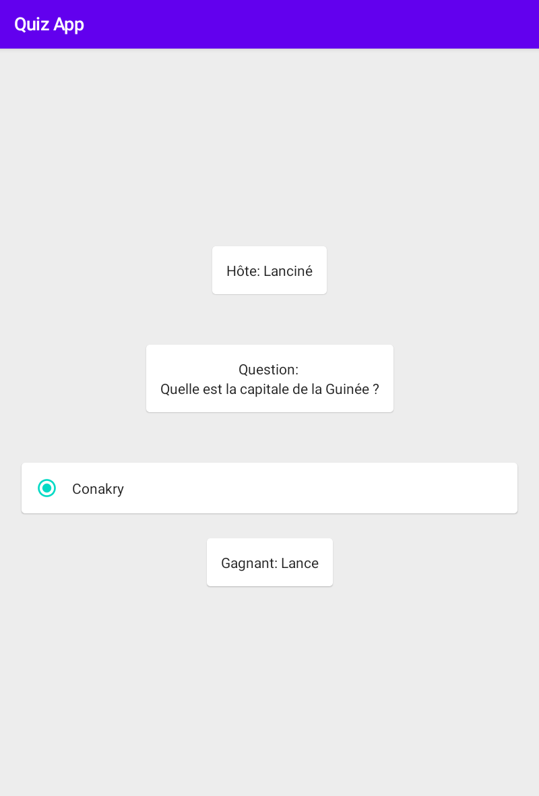

# Quiz en Temps Réel

## Fonctionnalités  
  
- Session de quiz locale entre un hôte et plusieurs clients connectés via Wi-Fi Direct ou Bluetooth
- Ne nécessite aucune Internet pour fonctionner
- Utilise l'API Google Nearby Connections et la librairie Jetpack Compose
- Questions à choix unique et à choix multiples
- Disponible en Français et en Anglais
  
## Installation  
Utilisez le fichier .apk fourni dans la section publications pour installer l'application.

L'installation nécessite au moins Android 8 (API 26).

##

# Realtime Quiz

## Features  
  
- Local quiz session between a host and several clients connected via Wi-Fi Direct or Bluetooth
- Doesn't require internet connection to function
- Uses Google's Nearby Connections API and the Jetpack Compose library
- Single choice and multiple choice questions
- Available in English and French
  
## Installation requirements  
Use the .apk provided in the release section to install the application.

Requires at least Android 8 (API 26) to install. 

## Images

